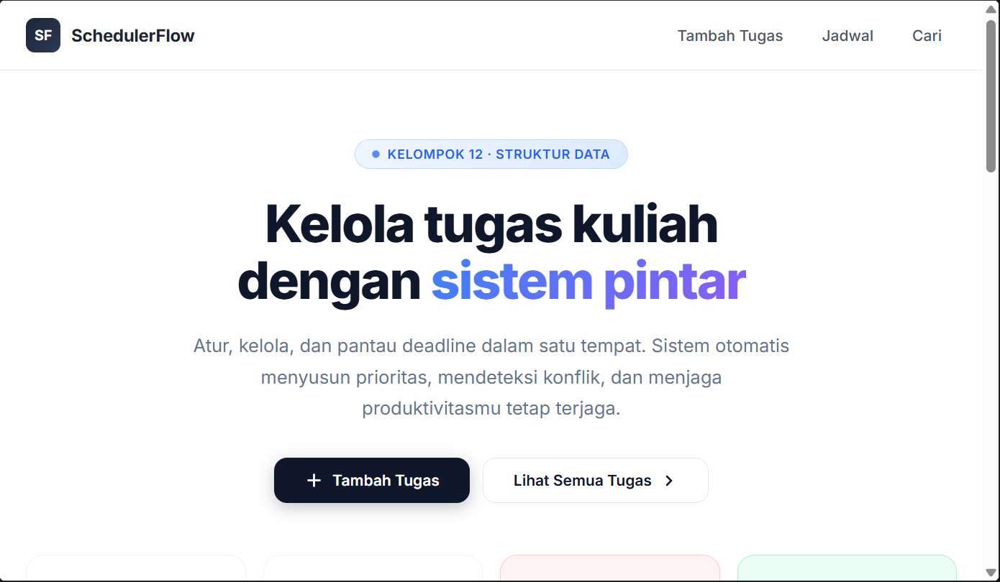
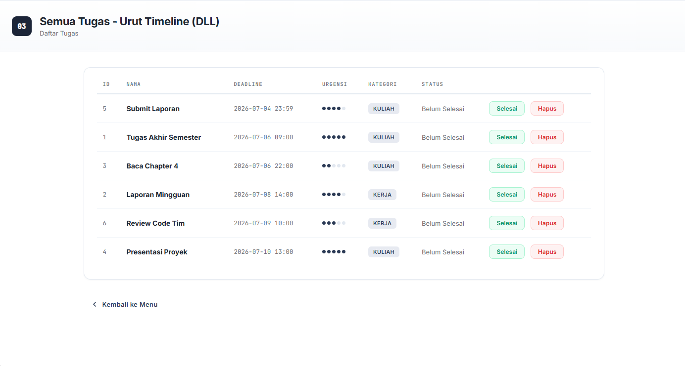
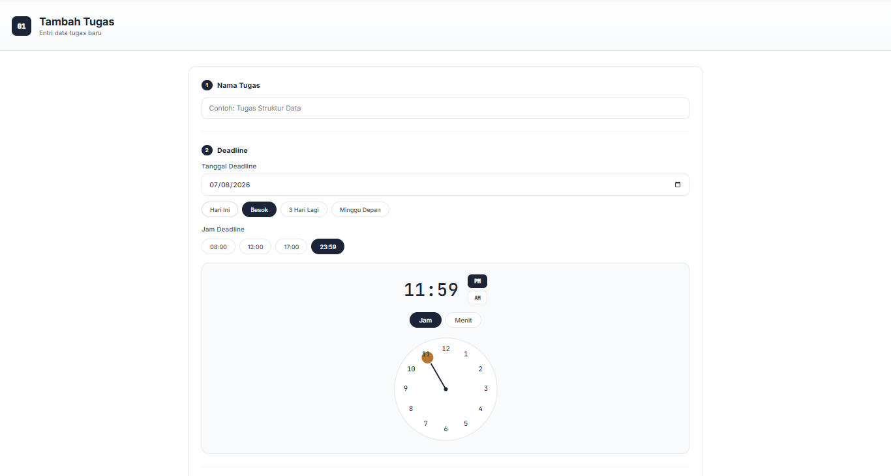
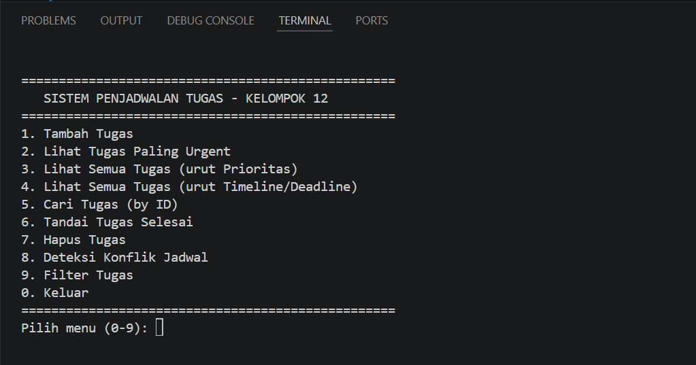
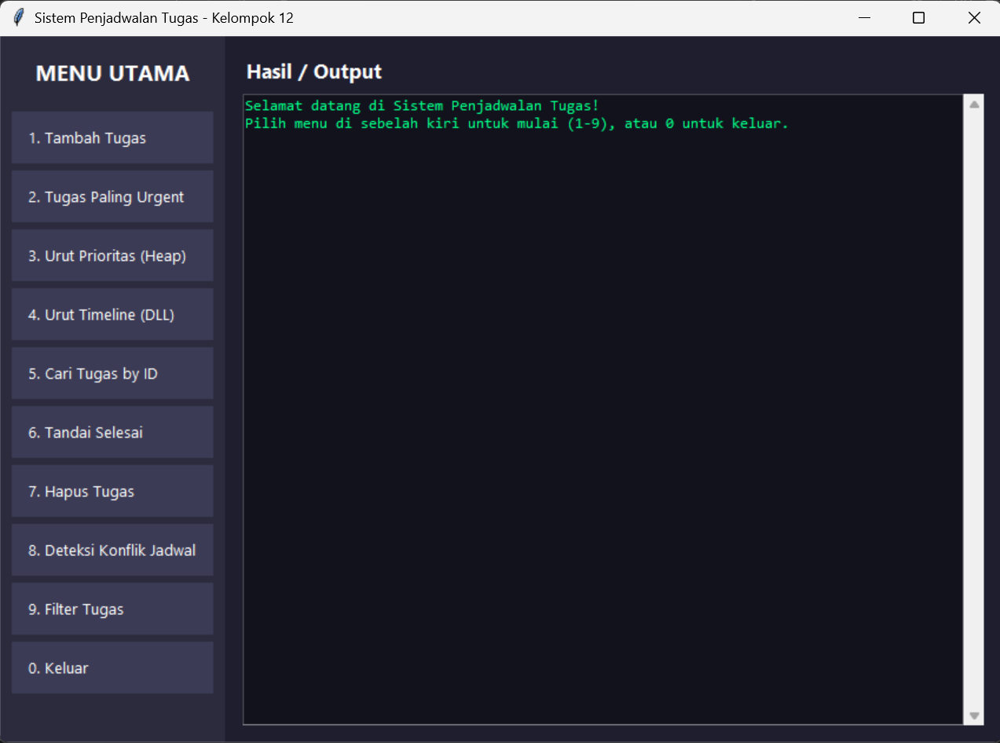

# TUGAS BESAR | SISTEM PENJADWALAN

## Pendahuluan
Project ini di buat memenuhi kebutuhan dalam beraktifitas, terutama untuk Membuat, Menentukan, dan Mengetahui jadwal kegiatan yang di perlukan oleh pengguna.

## Fitur Utama
- Membuat Jadwal.
- Melihat Jadwal.
- Menentukan Urgensi Kegiatan dengan data waktu yang sudah di tentukan.
- Analisis Jadwal yang ber tabrakan.

## Bahasa Pemograman
- Pyhton
- HTML

## Instalasi

-----------------------------------------------------------------------------------------------------------------------

1. Clone repositori yang ada di bawah ( Menggunakan Git Bash ):
   
- git clone https://github.com/mtzyexqiu/GitTask.git
- cd GitTask

-----------------------------------------------------------------------------------------------------------------------

2. Akses Aplikasi/Website :

- Buka Terminal :
py app.py

-----------------------------------------------------------------------------------------------------------------------

3. Akses CLI :
- Buka Terminal :
py main.py

-----------------------------------------------------------------------------------------------------------------------

4. Akses GUI :
- Buka Terminal :
py gui_app.py
-----------------------------------------------------------------------------------------------------------------------
 
 # UI   WEBSITE

 
 
 

 # UI CLI

 

 # UI GUI

 

-----------------------------------------------------------------------------------------------------------------------

THANKS
HAVE A NICE DAY
- ^^
